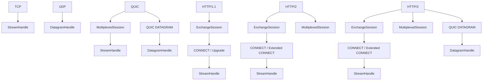

# Architecture Blueprint

## 1. Status and intent

clash-native is an experimental native C++ proxy core inspired by the design
of Clash and Mihomo. It is an independent implementation: Mihomo provides
architectural and behavioral reference points, but its source tree is not part
of this project.

This document defines the intended boundaries of the project before the
protocol surface becomes large. It is a blueprint, not a claim that every
described component is already implemented or production-ready. The current
implementation includes SOCKS5 and HTTP/1.1 inbound entry paths, including
CONNECT, ordinary forwarding, HTTP/1.1 Upgrade forwarding, optional Basic
authentication, and HTTP/1.1 keep-alive exchanges. It also includes
stream/datagram outbound contracts,
Direct, Reject, Shadowsocks, Trojan, and encrypted DNS transports. Current
protocol code and tests remain the evidence for actual support; a planned
boundary in this document is not implementation proof.

The current `ProxySession` integration path is transitional. Its server
lifecycle, shared session state, HTTP handling, SOCKS5 handling, and local
stream adapter are kept in separate implementation units. It must not become
the base class or control-flow template for future inbound, outbound, carrier,
or relay code.

## 2. Goals

- Build a reusable native C++ proxy engine named `clash-native-core`.
- Keep the core independent of any particular process, CLI, or foreign
  language ABI.
- Support a standalone `clash-native` process as one frontend over the core.
- Support a C API as another frontend over the same core.
- Keep protocol logic portable and isolate operating-system integration behind
  platform capability interfaces.
- Complete and functionally validate the portable proxy core on Windows before
  implementing native platform traffic-capture and route-management features.
- Use explicit ownership, cancellation, and shutdown rules for every
  asynchronous resource.
- Scale network work across multiple Asio runtimes without sharing mutable
  connection state between them.
- Prefer dependencies available through vcpkg when their ports, build options,
  licenses, and supported targets are suitable.
- Use Zig's C and C++ compiler drivers as the Linux release and
  cross-compilation toolchain.
- Keep Linux deployment possible on old router-oriented systems, with Linux
  3.10 and glibc 2.17 as the initial compatibility baseline.

## 3. Non-goals for the first stage

- Production readiness or security claims.
- Source compatibility with Mihomo internals.
- Complete Mihomo configuration or control API compatibility.
- Implementing every proxy protocol before the core lifecycle is validated.
- Implementing TUN, transparent proxying, route manipulation, or other native
  platform features before ordinary proxy flows work.
- Treating ngtcp2/nghttp3 callbacks as the public asynchronous model; their
  callbacks remain private to the QUIC transport adapter.
- Passing every packet or stream chunk through a cross-runtime channel.

Mihomo-compatible configuration and control surfaces may be added later as
frontends or translation layers. They must not redefine the internal core
model.

## 4. Product boundaries

```text
                    +-----------------------+
                    | clash-native process  |
                    | CLI, signals, control |
                    +-----------+-----------+
                                |
                                v
+-------------------+   +-----------------------+
| C API facade      |-->| clash-native-core     |
| opaque ABI types  |   | engine and lifecycle  |
+-------------------+   +-----------+-----------+
                                |
                   +------------+------------+
                   | runtime and platform     |
                   | capability adapters      |
                   +-------------------------+
```

`clash-native-core` is the primary product and owns the actual proxy engine.
The process executable and C API are peers above it:

- The process frontend owns command-line parsing, signals, process-level
  configuration sources, and an optional control service.
- The C API facade translates stable C ABI calls, callbacks, and error values
  into core operations.
- Neither frontend contains routing, protocol, DNS, relay, or QUIC logic.
- The core never depends on CLI or C API headers.

## 5. Dependency direction

The intended dependency direction is top to bottom only:

```text
frontends: daemon / C API
              |
composition: engine / lifecycle / configuration application
              |
policy: metadata / router / rules / groups / runtime snapshot
              |
data plane: inbound / outbound / relay / DNS
              |
proxy protocols: SOCKS / HTTP proxy / Shadowsocks / Trojan / QUIC protocols
              |
carriers: TLS / HTTP 1-3 sessions / WebSocket / QUIC / KCP
              |
I/O: TCP / UDP / resolver / timers / buffers
              |
runtime and platform capability interfaces
```

Cross-cutting facilities such as logging, metrics, errors, and cancellation
must expose dependency-light interfaces. They must not create upward
dependencies from the I/O or protocol layers into a frontend.

## 6. Proposed core modules

The exact directory names may evolve, but each responsibility needs an
independent boundary.

| Module | Responsibility |
| --- | --- |
| `base` | Dependency-light types, addresses, errors, IDs, and utilities |
| `async` | stdexec integration, scopes, channels, and scheduler adapters |
| `runtime` | Worker runtimes, blocking pool, lifecycle, and task ownership |
| `net` | Portable stream/datagram handles, endpoint dialing, buffers, timers, and resolver facade |
| `config` | Raw input model, validation, and immutable runtime descriptions |
| `inbound` | Listener/session interfaces and inbound protocol implementations |
| `metadata` | Normalized source, destination, network, and inbound information |
| `router` | Rule evaluation and outbound selection |
| `outbound` | Direct, reject, proxy, and proxy-group abstractions |
| `relay` | TCP copying, half-close, backpressure, idle timeout, and accounting |
| `dns` | Resolver policy, cache, hosts, and later enhanced DNS behavior |
| `transport` | Reusable TLS, HTTP, WebSocket, QUIC, and KCP carrier engines and session pools |
| `protocol` | Proxy handshakes and protocol-specific stream/packet transports |
| `platform` | Capability interfaces plus isolated operating-system backends |
| `observability` | Logging facade, metrics, connection registry, and tracing hooks |

A protocol implementation may depend on portable network and cryptographic
interfaces. It must not call Linux, Windows, or mobile APIs directly.

## 7. Core data path

### 7.1 TCP

The first architectural proxy flow is:

```text
listener
  -> inbound protocol session
  -> normalized ConnectionMetadata
  -> router and rule engine
  -> selected outbound
  -> outbound protocol connection
  -> bidirectional relay
  -> accounting and deterministic close
```

`Direct` and `Reject` are normal outbound implementations, not special cases
inside the listener. SOCKS5 and HTTP parsing belong to inbound protocol
sessions and do not own routing or direct dialing.

The relay layer must eventually define and test:

- backpressure and bounded buffering;
- cancellation of both directions;
- TCP half-close behavior;
- idle, connect, and handshake timeouts;
- first-error and simultaneous-close behavior;
- connection accounting and final status.

### 7.2 UDP

UDP has a separate session model:

```text
UDP listener
  -> PacketMetadata
  -> session/NAT key
  -> DNS and routing policy
  -> OutboundPacketTransport
  -> response mapping and expiry
```

UDP must not be modeled as a TCP connection with different read calls. It
requires explicit definitions for session identity, multiple destinations,
expiry, MTU, packet ownership, and error handling.

### 7.3 Stable protocol-facing contracts

The reusable boundary is not a universal wire-protocol base class. It is the
small contract between the engine and an outbound implementation. The router,
DNS dial policy, relay, accounting, and frontends must not need a new code path
when a protocol is added.

At that boundary, every outbound presents the same two data-plane entry points
and may support either or both:

- establish a byte-stream connection for a normalized destination;
- establish a datagram association capable of sending and receiving addressed
  packets.

The following sketch expresses the intended shape. Names and concrete result
types may change before implementation and are not a frozen public ABI:

```cpp
struct OutboundCapabilities {
  bool stream;
  DatagramSemantics datagram;
  TargetRequirement stream_target;
  TargetRequirement datagram_target;
};

class Outbound {
 public:
  virtual const OutboundDescriptor& descriptor() const noexcept = 0;
  virtual OutboundCapabilities capabilities() const noexcept = 0;

  virtual stdexec::task<Result<StreamOpenResult>> connect_stream(
      StreamRequest request) = 0;

  virtual stdexec::task<Result<DatagramOpenResult>> open_datagram(
      DatagramRequest request) = 0;

  virtual ~Outbound() = default;
};
```

`DatagramSemantics` distinguishes unsupported, fixed-destination, and
multi-destination associations. Whether the association uses native UDP,
stream encapsulation, or a multiplexed session is an implementation detail,
not a new router-facing operation.

`Direct`, `Reject`, encrypted proxy protocols, and outbound groups implement
the same engine-facing contract. Unsupported operations return a typed
unsupported result and must agree with the advertised capabilities.

The minimum descriptor contains stable identity and protocol kind for routing,
diagnostics, and configuration references. JSON serialization, API response
formatting, delay history, health state, and dashboard fields do not belong to
this interface.

This follows the useful part of Mihomo's `ProxyAdapter` design: its tunnel
normally needs only a stream dial operation or a packet operation. It
deliberately does not copy the broader interface, which also contains
presentation, health, group-unwrapping, and protocol-specific flags.

### 7.4 Requests, destinations, and established handles

`ConnectionMetadata` describes the observed inbound flow and routing facts. A
protocol must not mutate shared metadata to perform DNS resolution, redirect
routing, or signal a special control action.

The engine derives immutable operation requests from metadata:

| Type | Required contents |
| --- | --- |
| `StreamRequest` | Destination, immutable flow context, optional replayable first payload, deadline, and trace context |
| `DatagramRequest` | Initial destination when applicable, association policy, deadline, and trace context |
| `Destination` | Either a domain plus port or an IP address plus port |

The request types do not expose raw configuration nodes. They refer only to
validated runtime objects owned by the active snapshot.

Successful operations return move-only established objects rather than raw
Asio sockets:

| Type | Responsibility |
| --- | --- |
| `StreamOpenResult` | Established stream, selected chain, and first-payload commit state |
| `DatagramOpenResult` | Established datagram handle, selected chain, and association semantics |
| `StreamHandle` | Asynchronous read, write, half-close, cancellation, endpoints, and transport ownership |
| `DatagramHandle` | Addressed send/receive, cancellation, association semantics, MTU information, and transport ownership |
| `MultiplexedSession` | Logical stream allocation, cancellation, capacity, retirement, and session ownership for a multiplexed carrier |
| `ExchangeSession` | Request/response heads, streaming bodies, cancellation, and stream-upgrade results over an HTTP-like exchange carrier |
| `ConnectionTrace` | Selected outbound/group chain and diagnostic annotations outside the I/O interface |

An asynchronous buffer view must remain valid until its operation completes.
The buffer API must therefore carry explicit ownership or a lease; protocol
implementations must not retain an unowned `span` across suspension.

`DatagramHandle` preserves packet boundaries and source addresses. Its send
operation takes a destination for every packet unless the handle explicitly
has fixed-destination semantics. Its receive result contains both the payload
and the peer address. Native UDP, UDP over a stream, and a multiplexed QUIC
session may implement the same handle, but their framing and session ownership
remain internal.

The addressed datagram API retains `Destination`; it must not reduce every
domain to an IP-only socket address at the engine boundary. A protocol that
supports remote DNS can encode the domain in each packet, while an
`ip_required` implementation receives a separately resolved target.

### 7.5 Address resolution contract

Destination resolution is an orchestration decision, not an incidental side
effect of a protocol method. Each outbound advertises the accepted target form
for stream and datagram operations:

- `domain_or_ip`: preserve a domain when the remote protocol can resolve it;
- `ip_required`: resolve through the selected resolver role before opening the
  protocol operation.

Proxy server endpoint resolution and proxied destination resolution are
different operations. The former uses `ProxyEndpointResolver`; a direct
destination uses `DirectResolver`; an outbound that supports remote resolution
may receive the original domain unchanged.

Resolution creates a separate operation input or resolved target. It must not
overwrite the flow's original destination because rules, logging, FakeIP
mapping, retries, and response translation may still need it. Resolution and
retry also must not introduce an outbound/resolver dependency cycle.

Configuration validation builds one dependency graph containing at least:

- outbound-group membership;
- an outbound used to reach another outbound's proxy server;
- DNS upstream egress through a named outbound or group;
- resolver roles required by those outbound endpoints.

The graph is validated for missing references, incompatible stream/datagram
capabilities, and cycles before publication. Runtime operations still carry a
visited-outbound guard and a bounded depth as defense against stale provider
state or implementation defects.

Layer-three protocols are not represented by an `is_layer_three` boolean on
the stream interface. When layer-three outbound support becomes necessary, it
will use a separate capability contract. This prevents DNS-loop avoidance and
IP-packet behavior from leaking into ordinary stream and datagram operations.

### 7.6 Composable outbound construction

A concrete outbound is assembled from explicit components:

```text
validated outbound description
  -> validated proxy-endpoint egress plan
  -> endpoint dialer
  -> optional carrier transport
  -> protocol handshake/framing
  -> established stream or datagram handle
```

The responsibilities are:

| Component | Responsibility |
| --- | --- |
| `EndpointDialPlan` | Retain the already selected and cycle-validated direct or chained egress used to reach one proxy server |
| `EndpointDialer` | Execute that plan for the requested proxy-server endpoint without performing traffic routing or outbound selection |
| `CarrierConnector` | Compose the reusable carrier capabilities defined in Section 15, such as TLS, WebSocket, HTTP, QUIC, or KCP |
| `ProtocolClient` | Authenticate, encode the requested destination, and install protocol framing |
| `OutboundOrchestrator` | Apply deadlines, cancellation, cleanup, tracing, and common result conversion |

Composition is an implementation-reuse mechanism, not a promise that every
carrier and protocol can be combined arbitrarily. Configuration validation and
the protocol factory expose only combinations with defined semantics and
tests.

A simple stream protocol normally performs:

1. connect to its configured server through its prebound `EndpointDialer`;
2. establish its configured carrier, such as TLS;
3. execute its destination handshake through `ProtocolClient`;
4. return the resulting `StreamHandle` to the common relay.

A datagram implementation may open a native UDP socket, create an association
over a control stream, or borrow a logical channel from a multiplexed session.
Those choices must not change the router or UDP relay interface.

QUIC-based protocols fit the same public outbound contract but do not have to
pretend that a QUIC connection is a decorated TCP stream. Their internal
carrier component may own a reusable QUIC session and open protocol streams or
datagram channels from it.

Common carrier components own carrier behavior only. They must not know about
traffic rules, inbound types, frontend configuration syntax, or a particular
proxy protocol's authentication fields.

The traffic router selects an `Outbound` for the original application flow.
It does not select an `EndpointDialer`, and the dialer does not re-run the
router. After an outbound is selected, that outbound uses its immutable,
validated `EndpointDialPlan` only to reach its own configured server endpoint.
The plan either performs a physical Direct dial or delegates to one specific
`Outbound` or outbound-group object retained from the active snapshot. This is
how chained proxies are represented; the dial request does not contain an
arbitrary outbound name for the dialer to resolve.

For delegated dialing, the already selected upstream outbound receives a
normalized internal-flow request whose destination is the downstream proxy
server. That upstream may execute its own prevalidated endpoint plan, but it
must not select the downstream outbound again. The configuration dependency
graph rejects static cycles, while the runtime visited-outbound guard and
bounded depth stop stale or dynamic recursion. Every delegated object is
retained for the operation lifetime and each hop is appended to the trace.
A QUIC carrier requires a datagram-capable endpoint plan, while an ordinary
TLS carrier requires a stream-capable plan.

Protocol construction uses an explicit registry assembled by core startup. A
factory receives a typed, validated protocol description plus a narrow service
bundle and returns an outbound. Compatibility frontends translate their raw
configuration into those descriptions. The registry must not depend on global
static initialization, and a protocol omitted at build time produces an
explicit unavailable-feature validation error.

### 7.7 Establishment, first payload, and retry

`connect_stream` success means that every locally observable step required by
the selected mode has completed. This includes endpoint connection, carrier
handshake, request transmission, and a positive peer response when the wire
protocol defines one. For protocols such as Shadowsocks or Trojan that do not
acknowledge the final target, success means only that their defined opening
steps have completed; it cannot promise that the destination application is
reachable.

The baseline implementation completes establishment before returning an
ordinary `StreamHandle`. A handle must not secretly open its carrier, perform
authentication, or wait for a protocol response on an unrelated first read or
write.

Early-data optimization requires an explicit first-flight contract:

```text
replayable initial payload owned by StreamRequest
  -> endpoint/carrier/protocol first flight
  -> StreamOpenResult reports payload uncommitted or committed
  -> common relay advances its input only after committed success
```

The initial payload is all-or-nothing at this boundary. On an uncommitted
failure, a group may try another eligible outbound with the same payload. Once
application bytes may have reached a peer, transparent fallback is forbidden
unless that protocol has a separately documented replay-safe operation.
Groups and health observers receive establishment-stage and commit information
directly; they must not discover handshake state by downcasting wrappers or
attaching an invisible callback to the first ordinary write.

QUIC 0-RTT and protocol early data follow the same rule. Arbitrary application
payload is not considered replay-safe merely because a transport library can
send it before handshake confirmation. Each protocol must define what can be
replayed and how rejection falls back to a confirmed session.

Connect, carrier-handshake, protocol-handshake, and idle deadlines are separate
policy values. A single expired deadline cancels the underlying I/O and drains
its completion before the operation reports timeout.

### 7.8 Inbound protocol boundary

Inbound and outbound implementations are intentionally asymmetric and must not
be forced into one protocol interface. They may share address codecs,
cryptographic primitives, and carrier implementations, but they have different
control flow.

An inbound protocol session performs the following work:

```text
accepted stream or received packet
  -> protocol parsing and authentication
  -> normalized metadata and destination
  -> engine dispatch
  -> protocol-specific success or failure response
  -> common relay or datagram session
```

The normalized inbound request carries an exactly-once reply controller when
the protocol requires a response after outbound establishment. For example,
SOCKS5 and HTTP CONNECT must not report success before the selected outbound
has actually opened. Protocols without such an acknowledgement use a no-op
reply policy.

Authentication negotiation and final connection acknowledgement are distinct
reply phases. A SOCKS5 inbound may acknowledge its selected authentication
method immediately, but the final CONNECT result is produced only from the
outbound open result. The reply controller maps typed engine failures to the
closest protocol-specific response and prevents duplicate success/failure
writes during cancellation races.

Inbound code may parse, authenticate, and encode its own replies. It must not
select an outbound, implement traffic rules, call Direct directly, or own the
common relay. Native TUN and transparent-proxy adapters eventually produce the
same normalized requests without adding a second routing path.

The local `ProxyServer` may terminate TLS before this protocol boundary when
PEM server credentials are configured before `start()`. The TLS wrapper is a
carrier decoration: after the asynchronous server handshake, HTTP-only and
mixed HTTP/SOCKS5 sessions use the same parser and relay path as plaintext
connections. Listener TLS does not add HTTP/2 or HTTP/3 proxy semantics.

### 7.9 Groups and management concerns

An outbound group implements the same stream and datagram operations. It
selects a member from the current immutable group state, retains that member
for the complete asynchronous operation, delegates the request, and appends a
selection record to `ConnectionTrace`.

Selection is operation-aware. A group asked for datagrams filters or rejects
members that cannot satisfy the required datagram and target semantics. Its
advertised capabilities are a conservative summary for validation and user
interfaces, not permission to select an incompatible member at runtime.

Failure feedback records the stage at which an operation failed and whether
application data was committed. Connection refusal, carrier handshake failure,
authentication failure, protocol rejection, timeout, and active-stream I/O
failure are not interchangeable health signals. Fallback policy may retry only
at a replay-safe boundary.

Selection, fallback, and load-balancing policy are separate from wire
protocols. A group must not unwrap itself through protocol-specific casts, and
the relay must not know whether its handle came through a group.

The following facilities wrap or observe an outbound instead of expanding the
core interface:

- health checking and URL tests;
- latency history and availability state;
- connection accounting and metrics;
- control-service and C API serialization;
- retry, fallback, and circuit-breaking policy;
- configuration compatibility views.

Routing actions that rewrite metadata or request another rule pass are also
separate router operations. They must never call a connection method merely to
produce a routing side effect.

### 7.10 Async ownership, cancellation, and reload

`stdexec::task` is lazy. Returning a task from a member function does not by
itself keep the outbound object alive until that task starts and completes.
The dispatch layer must retain a strong reference to the selected outbound in
the operation state. An established handle must likewise retain every carrier,
session pool, and immutable configuration object required for its lifetime.

Reload publishes a new outbound registry but retires the old registry only
after its operations and handles drain. A connection opened from an old
snapshot continues using that snapshot; it must not start reading protocol
options from the new configuration midway through a session.

Stateful outbounds and carrier pools follow `active -> retiring -> drained`.
A retiring instance rejects new opens but continues serving existing streams
and datagram associations. Its pool, timers, and transport are destroyed only
after all child handles and operations have released their ownership. New
configuration never closes a shared QUIC or multiplexed session out from under
an established flow.

Every connect, handshake, datagram-open, read, and write operation receives the
parent stop token. Cancellation must reach the lowest cancellable Asio or
QUIC transport operation, and completion must be observed before its state is
destroyed. Protocol implementations must not start detached cleanup or reader
loops that escape their session scope.

Expected network failures use the project's typed error model. Cooperative
cancellation remains `set_stopped`; it is not silently converted into a
generic socket error. The common error taxonomy must distinguish at least
resolution, endpoint connection, carrier handshake, authentication, protocol
framing, timeout, rejection, unsupported capability, and transport I/O. The
full mapping between `Result`, sender completion, and exception containment is
defined in the error model.

### 7.11 Protocol extension contract

Adding a normal outbound protocol should require only:

1. a validated protocol description and explicit factory registration;
2. its authentication, handshake, and stream framing implementation;
3. its datagram framing and association implementation when supported;
4. composition with supported endpoint and carrier components;
5. an accurate capability declaration;
6. protocol-specific interoperability and malformed-input tests.

It must not require edits to the router, common TCP relay, common UDP relay,
DNS policy engine, connection registry, standalone frontend, or C API.

Every outbound implementation, including Direct, Reject, and groups, runs
through a shared conformance suite covering:

- capability declarations and unsupported-operation behavior;
- domain and IP destination handling;
- direct and chained proxy-server endpoint paths, including dependency-cycle
  rejection;
- cancellation before start, during connection, during handshake, and during
  active I/O;
- establishment readiness, first-payload commit, replay-safe fallback, and
  protocol early-data rejection;
- timeout and failure cleanup without leaked operations;
- scheduler affinity and absence of detached work;
- TCP relay, half-close, peer-close, and backpressure behavior when stream is
  supported;
- packet boundaries, source-address preservation, multiple destinations, and
  association expiry when datagrams are supported;
- pooled-session capacity, retirement, and child-handle lifetime when
  multiplexing is supported;
- operation and handle lifetime across configuration reload;
- independent implementation interoperability for each wire protocol.

The current SOCKS inbound is split into listener lifecycle, session, stream
relay, and UDP listener modules. It supports SOCKS4/4a CONNECT, SOCKS5 CONNECT,
UDP ASSOCIATE, RFC 1929 username/password authentication, and an optional
standalone UDP listener through the native API. Advanced listener policy and
CLI configuration remain separate work.

## 8. Runtime model

### 8.1 Runtime set

The core uses multiple independent Asio runtimes. The worker count is
configurable and defaults to four.

Each worker owns:

- one `boost::asio::io_context`;
- one scheduler adapter for stdexec;
- one work guard;
- one worker thread;
- a structured-concurrency scope for its long-lived child operations;
- the sessions and protocol objects assigned to that worker.

The runtime count is a configured count, not automatically identical to the
number of logical CPUs. A later configuration layer may offer an `auto` mode.

### 8.2 Affinity

A connection is assigned to one worker and remains there for its lifetime.
Its sockets, timers, resolver operations, ngtcp2/nghttp3 connection objects, and
mutable protocol state must not migrate between workers.

Load balancing happens when a new session is accepted. Listener distribution
is a platform/runtime strategy: implementations may use a shared acceptor,
per-worker acceptors where supported, or another adapter. Protocol code must
not depend on the selected accept strategy.

Cross-worker communication carries commands, immutable snapshots, ownership
transfers made before a session starts, and aggregated events. The hot data
path should not bounce packet buffers between workers.

### 8.3 Blocking work

A separately configurable blocking pool is allowed for operations that cannot
be expressed as non-blocking I/O, such as selected filesystem, database, or
CPU-heavy jobs.

Blocking work must never execute on an I/O worker. Its result returns through
a sender or channel and must resume on the owning I/O scheduler before it
touches session state.

## 9. stdexec and channel usage

### 9.1 stdexec boundary

Asio remains the network and timer runtime. stdexec is used to compose
operations, express cancellation, maintain scheduler affinity, and own
concurrent child work.

- `starts_on` selects where an operation and a task's home scheduler begin.
- `continues_on` moves downstream work to an explicitly selected scheduler.
- `on` is reserved for temporarily executing a nested operation elsewhere and
  returning to the caller's scheduler.
- ngtcp2/nghttp3 callbacks remain callbacks inside the QUIC adapter.
- Callback-based external APIs should be wrapped as senders at their adapter
  boundary instead of exposing callback state to business layers.

### 9.2 Channel primitive

The Tokio-style channel implementation from `dart_cpp_bridge` is a candidate
for extraction into the core async module. It provides:

- move-only `oneshot` request/result delivery;
- cloneable-producer, single-consumer MPSC delivery;
- bounded MPSC with asynchronous backpressure;
- zero-capacity rendezvous channels;
- close propagation;
- stop-token-aware cancellation of parked sends and receives.

The implementation may be reused, but it must be imported as an owned core
component rather than retaining Dart-specific names or include paths. The
import must also:

- preserve the applicable MIT license notice and record its provenance;
- port the existing channel concurrency and cancellation tests;
- decide whether the generic stream-combinator dependency is needed by the
  proxy core;
- account for its stdexec and `rigtorp::MPMCQueue` dependencies;
- use the project namespace and formatting rules.

Recommended uses are:

| Need | Primitive |
| --- | --- |
| one operation result or request/reply | `oneshot` |
| bounded worker/control queue | bounded MPSC |
| synchronous handoff with no queue | zero-capacity MPSC |
| low-volume event stream with a proven bound elsewhere | unbounded MPSC |

Unbounded channels are not the default for traffic-bearing queues. Channels
must not become a packet relay bus between I/O workers.

Channel completion can run on the thread that sends, closes, or requests
cancellation. A continuation that touches worker-owned state must explicitly
return to the owning scheduler or run inside a task whose home-scheduler
behavior has been verified.

### 9.3 What channels do not solve

Channels simplify cross-runtime ownership and request/reply flows, but they do
not by themselves guarantee:

- that child tasks have completed before their owner is destroyed;
- that a socket, timer, or ngtcp2/nghttp3 object is accessed only on its owner thread;
- that callback contexts outlive late callbacks;
- that all parked sends and receives are completed during shutdown;
- that application objects are destroyed after their runtime dependencies.

Those guarantees belong to the runtime, scope, adapter, and shutdown design.

## 10. Error model and exception containment

The error model must preserve actionable failure information without assuming
that every C++ or third-party operation is non-throwing. A `Result` return type
describes expected operational failure. It does not promise that an unexpected
C++ exception can never occur.

### 10.1 Result vocabulary

The core uses one dependency-light project vocabulary for synchronous and
domain-level asynchronous results. The intended shape is:

```cpp
enum class ErrorCode : std::uint16_t {
  invalid_argument,
  invalid_configuration,
  unsupported,
  resolution_failed,
  connection_failed,
  handshake_failed,
  authentication_failed,
  protocol_error,
  timed_out,
  rejected,
  transport_error,
  resource_exhausted,
  internal_error,
};

struct Error {
  ErrorCode code;
  std::error_code cause;
  std::string context;
};

template <class T>
using Result = tl::expected<T, Error>;

using Status = Result<void>;
```

This is an illustrative storage shape, not a frozen ABI. The stable semantics
are:

- `ErrorCode` is a project-owned, transport-independent classification used by
  policy and frontend translation;
- `cause` preserves an operating-system, Asio, TLS, or other underlying error
  code when one exists;
- diagnostic context explains the operation and stage without replacing the
  machine-readable code;
- protocol-specific details may enrich an error internally, but normal callers
  must not depend on a separate error type for every protocol.

Only the base result header may name `tl::expected` and `tl::unexpected`
directly. Other project code uses `Result<T>`, `Status`, and a project helper
such as `fail(Error)`. This prevents one third-party vocabulary from spreading
through the source tree and keeps a later move to `std::expected` tractable.

### 10.2 Failure channels

Each failure class has exactly one primary representation:

| Condition | Representation |
| --- | --- |
| Expected configuration, resolution, connection, handshake, authentication, protocol, timeout, rejection, resource, or I/O failure | `Result<T>` containing `Error` |
| Cooperative cancellation or intentional abandonment | `set_stopped()` |
| Unexpected exception escaping task code | `set_error(std::exception_ptr)` |
| Programmer invariant violation | assertion or controlled termination |
| Fatal process or runtime failure | top-level containment and shutdown policy |

Cancellation is not an `ErrorCode`. Converting cancellation into a timeout or
generic I/O error prevents structured concurrency from distinguishing a stop
request from an actual failed operation.

An absent value that is part of normal behavior uses `std::optional`, not a
success-valued `Result` with a fabricated error. Conversely, an error that
changes routing, fallback, retry, or client response behavior must not be
reduced to `false`, an empty optional, or an unstructured string.

### 10.3 Propagation and context

Functions returning `Result<T>` are not automatically `noexcept`. Known,
recoverable failures are returned explicitly, while an unexpected exception
may propagate to the nearest execution containment boundary. A function is
marked `noexcept` only when its complete implementation and callees satisfy
that contract; violating `noexcept` terminates the process and cannot be
recovered by an outer catch.

Ordinary layers do not catch and rethrow every error. They either propagate the
result unchanged or add context when the semantic operation changes, for
example from a socket connection failure to a named proxy-server connection
failure. Code should prefer the future-standard operations `and_then`,
`transform`, `or_else`, and `transform_error` where they remain clear.

Errors are normally logged once by the boundary that finally observes or acts
on them. Lower layers return information; they do not repeatedly log and
return the same failure. Connection groups and routing policy may inspect an
error to decide fallback or retry before the frontend renders the final
diagnostic.

A catch-all must not mechanically convert every exception into an ordinary
recoverable `internal_error`. In particular, allocation failure, violated
invariants, and unknown third-party failures may require session termination,
runtime shutdown, or process termination rather than continued operation in a
potentially invalid state.

### 10.4 stdexec mapping

The core follows a Rust-like asynchronous result shape for expected domain
failures:

```text
task<Result<T>>
  set_value(Result<T>)        expected success or operational failure
  set_stopped()               cooperative cancellation
  set_error(exception_ptr)    unexpected C++ exception
```

Expected failures carried by `Result<T>` are value completions from the
sender's perspective. Generic `upon_error` does not see them. Retry, fallback,
group selection, and protocol response logic must inspect the `Result`
explicitly. A pipeline must never create `Result<Result<T>>`.

Asio adapters should use non-throwing `error_code` completion forms where
available. They map successful completion to a successful result, cancellation
errors such as operation aborted to `set_stopped()`, and other expected I/O
errors to the project `Error`. Callback adapters complete exactly once and
must not allow an exception to escape through a C callback or receiver
completion function.

An unexpected exception inside a task is allowed to reach its sender error
channel. Every spawned session, service, and background operation must attach
an error-observing receiver or a common guarded-spawn helper. A potentially
failing sender must not be passed to a detached consumer whose error behavior
is termination. Final `upon_error` and `upon_stopped` handlers used for
detached work are explicitly `noexcept`.

### 10.5 Exception containment boundaries

Exception containment is concentrated at execution roots rather than repeated
throughout business logic:

- a session or service spawn boundary observes `set_error` so one unexpected
  exception does not silently terminate the entire runtime;
- each blocking-pool job wrapper captures an unexpected exception and reports
  it through its result channel;
- each Asio runtime thread contains exceptions escaping `io_context::run()`,
  reports them as critical diagnostics, and applies the runtime continuation or
  shutdown policy;
- the standalone frontend contains exceptions at `main()` and maps the final
  outcome to an English diagnostic and process exit code;
- every C API entry point catches exceptions before they cross the C ABI and
  translates them into a stable C error result;
- callbacks invoked through a C ABI are `noexcept` at the ABI edge and convert
  any C++ callback failure before returning to foreign code.

Asio permits an exception thrown by a handler to propagate from the current
thread's `io_context::run()` call. Other runtime threads are unaffected, and
the throwing thread may call `run()` again after containment. The project must
define which exception classes allow that continuation. Unknown exceptions or
evidence of a broken invariant stop the affected runtime instead of blindly
resuming it.

Destructors remain non-throwing. Cleanup failure is reported before destruction
where possible; a destructor must not introduce a second exception during
stack unwinding.

### 10.6 Frontend and C ABI translation

The standalone frontend owns final presentation. It converts structured errors
to English CLI messages, assigns process exit codes where appropriate, and
includes chained diagnostic context without exposing sensitive configuration
or credentials.

The C API exposes a stable, fixed-width error-code enum plus explicitly owned
or borrowed diagnostic text. It does not expose `tl::expected`, C++ standard
library types, `std::exception_ptr`, `std::error_code`, or C++ exceptions. The
facade maps the richer internal error to the closest stable public code while
retaining detailed diagnostics through an explicitly documented mechanism.

### 10.7 `tl::expected` dependency policy

The C++20 baseline does not provide `std::expected`, which is a C++23 library
facility. The initial implementation therefore uses the header-only,
CC0-licensed `tl::expected` package through its vcpkg port. The selected vcpkg
baseline pins the actual package version.

Project code uses only behavior aligned with `std::expected`, including
`and_then`, `transform`, `or_else`, and `transform_error`. The tl-specific
`map` and `map_error` names are not used. Construction of unexpected values is
hidden by the project result header so differences between `tl::unexpected`
and `std::unexpected` do not leak into call sites.

Adding `tl::expected` does not by itself make the complete program safe to
compile without C++ exceptions. Exception support remains enabled initially.
A no-exception build is a separate deployment decision that requires verifying
stdexec, Asio, ngtcp2, nghttp3, the standard library, logging, allocation behavior, and
all other dependencies on each supported toolchain. The result abstraction
should make such an evaluation easier without claiming it has already passed.

The dependency and result wrapper require Windows Clang x86-64 build coverage.
Zig-based Linux x86-64 profiles require their own compile and runtime
validation before the dependency is considered portable across release
targets. Support for 32-bit x86 is deferred and is not part of the current
acceptance criteria.

## 11. Ownership, cancellation, and shutdown

Every long-lived asynchronous operation must be owned by a service scope or a
session scope. Detached work without an owner is not part of the core model.

Cancellation is cooperative and must propagate from engine to service, from
service to session, and from session to its I/O operations. Destructors are a
last safety boundary, not the primary cancellation mechanism.

The intended engine shutdown sequence is:

1. Reject new public operations and configuration changes.
2. Stop accepting new sessions.
3. Request stop on service and session scopes.
4. Close control/work channels and cancel outstanding I/O.
5. Drain all scopes while their worker event loops are still running.
6. Release work guards after owned operations have completed.
7. Join worker and blocking-pool threads.
8. Destroy runtime-dependent services and platform adapters.

No frontend may destroy `clash-native-core` while a callback into that
frontend is still possible.

## 12. Configuration and reload

The initial configuration model reuses Mihomo's core concepts but does not
promise syntax compatibility.

```text
configuration source
  -> RawConfig
  -> validation and normalization
  -> immutable RuntimeSnapshot
  -> Engine::apply(snapshot)
```

Runtime code consumes validated objects and must not repeatedly interpret raw
YAML fields. A future Mihomo-compatible parser should translate into the same
validated model rather than creating an alternate engine path.

Reload must construct and validate the replacement state before publishing
it. Reusable state may be retained deliberately, but running components must
not observe a half-applied configuration.

## 13. Traffic routing and metadata enrichment

Traffic routing is a core service shared by every inbound, outbound, and
frontend. It is independent of any particular proxy protocol and is not part
of DNS upstream selection. The first implementation should preserve Mihomo's
useful routing concepts without copying its configuration parser or coupling
rules to mutable connection objects.

The routing path is:

```text
normalized inbound metadata
  -> optional explicit metadata transform
  -> ordered TrafficRouter evaluation
  -> lazy metadata enrichment when requested
  -> RouteDecision
  -> outbound or group resolution
```

Rules inspect metadata and return evaluation results. They must not dial
connections, perform DNS or platform queries directly, mutate shared
metadata, choose members inside a proxy group, or emit the final connection
decision. Those responsibilities belong to the router and the services it
coordinates.

### 13.1 Routing metadata

The router receives immutable `ConnectionMetadata` containing facts learned
at the inbound boundary, including where available:

- source address and port;
- original destination host or address and port;
- network type;
- inbound name and type;
- authenticated user;
- a separately identified sniffed-host candidate.

The original domain name and a resolved destination address must be retained
as separate values. Resolving a domain must not overwrite the domain, because
later rules and the selected outbound may need both. A sniffed host also
remains distinguishable from the original destination and records its
provenance rather than silently replacing it.

Each routing operation owns a mutable, per-flow `RoutingContext`. It contains
only derived state, such as:

- destination-address lookup state and result;
- process-attribution lookup state and result;
- cached GeoIP, ASN, or set membership results;
- the current rule cursor and bounded rematch state.

Lookup state distinguishes at least `unrequested`, `in_progress`, `resolved`,
and `failed`. It is never shared as mutable state between unrelated
connections.

### 13.2 Ordered evaluation protocol

Traffic rules use ordered first-match semantics. Evaluation is one ordered
traversal, not a domain-rule pass followed by DNS and then an unconditional
second pass from the beginning.

A rule evaluation has three conceptual outcomes:

```cpp
struct NoMatch {};
struct Matched {
  RouteAction action;
};

enum class MetadataNeed {
  destination_ip,
  process_info,
};

struct NeedMetadata {
  MetadataNeed need;
};

using RuleEvaluation =
    std::variant<NoMatch, Matched, NeedMetadata>;
```

This sketch defines behavior rather than fixing the final C++ representation.
Pure rule evaluation must not block or suspend. The asynchronous
`TrafficRouter` owns the rule cursor and handles `NeedMetadata`:

1. evaluate the current rule against the available context;
2. return immediately when the rule produces `Matched`;
3. advance to the next rule when it produces `NoMatch`;
4. when it produces `NeedMetadata`, suspend the routing operation and ask the
   appropriate resolver or platform capability for that metadata;
5. store the outcome in the per-flow context and re-evaluate the same rule;
6. continue from that point rather than restarting at the first rule.

Domain, domain-suffix, and domain-set rules inspect domain metadata and never
trigger DNS merely to test themselves. Destination IP, GeoIP, ASN, and IP-set
rules may request destination resolution only when no usable address is
already present and the rule permits resolution. Process rules request
process attribution through the same lazy protocol.

### 13.3 Resolution and `no-resolve` semantics

A literal destination IP satisfies the destination-address requirement
without a DNS query. A domain destination is resolved lazily only when the
ordered evaluation reaches a rule that needs its IP address.

An IP-dependent rule marked `no-resolve` must never initiate DNS. It matches
only when the routing context already contains an address, for example from a
literal destination, FakeIP reverse mapping, transparent-proxy metadata, or
an earlier enrichment step.

Only one destination-resolution attempt is made by one ordinary routing
decision. Multiple later IP-dependent rules consume the recorded result or
failure rather than issuing duplicate queries. If resolution fails, the
current IP-dependent rule becomes a non-match and ordered evaluation
continues. A later connection stage that requires an IP consumes the recorded
outcome unless an explicit resolver policy permits a distinct retry.

Cancellation stops the enrichment operation and the complete routing
operation. It maps to the stopped completion channel rather than to a
synthetic rule miss. Resolver roles remain explicit so lazy enrichment cannot
create an accidental DNS/outbound dependency cycle.

### 13.4 Route decisions and actions

`RouteDecision` identifies the selected action and enough provenance for
observability. It should contain, as applicable:

- a built-in `Direct` or `Reject` action;
- a named outbound or outbound group;
- the matched rule identity and optional rule payload;
- the immutable runtime snapshot that owns referenced configuration;
- an explicit reason when the default action was selected.

Configuration validation ensures that every named target exists and that the
combined outbound, group, chained-endpoint, and resolver graph is acyclic.
Rule evaluation selects a group but does not select one of its members; group
policy runs afterwards through the ordinary outbound-resolution path.

Every `RuntimeSnapshot` contains an explicit default action. A frontend may
normalize an omitted user setting to `Direct`, but the running router must not
depend on a hidden fallthrough.

Metadata transformation and rematching are explicit router actions. If a
future compatibility layer needs sub-rules, metadata rewrites, or another
rematch, it must use bounded depth and cycle detection. A connection or
outbound must not restart routing as an undocumented side effect.

### 13.5 Rule model and initial matcher scope

Rules are immutable values owned by a runtime snapshot. Common matchers may
be composed, but their matching logic stays independent of configuration
syntax. The internal model should be able to represent, over time:

- domain exact, suffix, keyword, regular-expression, and domain-set rules;
- destination and source IP CIDR, GeoIP, ASN, and IP-set rules;
- source and destination port rules;
- TCP, UDP, and inbound identity rules;
- authenticated user, process, executable path, and platform-specific
  metadata rules;
- external rule sets, logical `AND`, `OR`, and `NOT`, and sub-rule dispatch;
- an explicit terminal/default action.

The initial implementation does not need every matcher. It establishes one
stable evaluation contract so adding a matcher does not require changes in
inbounds, outbounds, relays, or frontends. Matcher-specific indexes and
compiled structures may be added behind that contract after profiling.

### 13.6 Separation from DNS and platform policy

Three decisions that all mention routing remain independent:

```text
application metadata -> TrafficRouter -> application outbound
DNS question name     -> DnsPolicyRouter -> DNS upstream group
DNS upstream endpoint -> DnsUpstreamDialer -> DNS connection outbound
```

`TrafficRouter` may ask `DefaultResolver` to enrich an application
destination. `DnsPolicyRouter` chooses which configured resolver should
answer a DNS question. `DnsUpstreamDialer` decides how the connection to that
resolver exits. Sharing matcher implementations does not merge these policy
layers.

Process attribution and other operating-system metadata are injected through
platform capability interfaces. When a capability is unavailable, an
optional rule treats that metadata as unavailable and does not match. Any
future rule that requires a capability must be rejected during configuration
validation on an unsupported product profile.

Portable routing tests on Windows use real portable providers or injected
fakes. Linux TUN, transparent proxy, original-destination recovery, and
process lookup are later adapters feeding the same metadata and router; they
do not create a second rule engine.

### 13.7 Ownership, reload, and concurrency

The compiled rule program and all referenced matcher data are immutable parts
of `RuntimeSnapshot`. A routing operation retains its snapshot until its
decision and any owned enrichment operations complete. Publishing a new
snapshot affects new operations without invalidating existing rule cursors or
matcher storage.

The per-flow `RoutingContext` is owned by the session scope and stays on its
owning scheduler. Asynchronous DNS or platform enrichment uses the established
request/channel boundary and resumes on that scheduler before the context is
updated. Stop requests propagate to all outstanding enrichment operations.

Metrics and diagnostics are emitted as separate events or concurrency-safe
counters. They must not make otherwise immutable rules or snapshots mutable.

### 13.8 Implementation and validation order

Routing should be delivered in independently testable slices:

1. define immutable connection metadata, per-flow routing context,
   `RouteAction`, `RouteDecision`, and an explicit default action;
2. implement pure ordered evaluation for domain, network, port, and inbound
   rules with `Direct`, `Reject`, and named targets;
3. add asynchronous destination-IP enrichment, IP CIDR rules, recorded lookup
   state, and `no-resolve`;
4. integrate resolver roles, DNS policy routing, and upstream egress routing;
5. add external rule sets, GeoData, process rules, logical composition,
   sub-rules, and bounded rematching only as their stages require them.

Unit and black-box tests must prove at least:

- rule order and first-match behavior;
- a matching domain rule performs no DNS query;
- the first IP-dependent rule triggers at most one resolution and resumes at
  the same rule rather than restarting the program;
- original domain metadata remains available after resolution;
- `no-resolve` never initiates a lookup;
- DNS failure allows later non-IP and default rules to run;
- cancellation stops routing and its enrichment operation;
- process lookup is lazy and an unavailable capability has defined behavior;
- reload preserves the old snapshot for in-flight routing operations.

## 14. DNS architecture

DNS is a core routing subsystem, not a utility hidden inside a socket dialer.
The core needs rich DNS behavior comparable in shape to mature proxy engines,
but its protocol, policy, and lifecycle responsibilities must remain separate.

### 14.1 Responsibility split

The DNS subsystem is divided into the following components:

| Component | Responsibility |
| --- | --- |
| `DnsPacket` | An owned complete DNS wire message plus validated header and question metadata |
| `DnsMessageCodec` | DNS message parsing, serialization, names, resource records, and safe transaction-ID rewriting |
| `DnsQueryService` | Full-message query API, cache, coalescing, policy, cancellation, and result delivery |
| `AddressResolver` | A/AAAA address lookup and CNAME-aware result assembly over `DnsQueryService` |
| `DnsTransport` | One logical DNS exchange over UDP, TCP, DoT, DoH, DoQ, or DoH3 |
| `DnsUpstream` | One configured server, transport, endpoint, and dial policy |
| `DnsUpstreamGroup` | Concurrent selection, fallback, health, and retry policy |
| `DnsCache` | Positive/negative entries, TTL expiry, stale policy, and limits |
| `DnsPolicyRouter` | Select an upstream group from the queried domain |
| `DnsUpstreamDialer` | Select how the connection to an upstream DNS server exits |
| `DnsServer` | Optional local UDP/TCP service over the full-message query API |
| `FakeIpStore` | Fake-IP allocation, reverse mapping, persistence, and expiry |

The wire codec may initially use a suitable maintained dependency. Upstream
selection, routing integration, caching policy, resolver roles, FakeIP, and
lifecycle belong to clash-native-core regardless of the codec choice.

The names above describe responsibility boundaries rather than a frozen C++
ABI. In particular, the current `ResolverService` may be split or renamed as
these boundaries are implemented.

### 14.2 Full-message queries and address resolution

A local DNS forwarder and an application address resolver are different
consumers of the same query engine:

```text
local UDP/TCP DNS client
  -> DnsServer
  -> complete DnsPacket
  -> DnsQueryService
  -> complete response DnsPacket

TrafficRouter / endpoint connector
  -> AddressResolver
  -> A and AAAA queries through DnsQueryService
  -> resolved address set
```

`DnsPacket` preserves the complete wire message even when the project-owned
codec does not yet interpret every resource-record type. Unknown records,
EDNS options, authority data, additional data, DNSSEC records, and response
flags must not be discarded merely because `AddressResolver` only needs IP
addresses.

`AddressResolver` is a typed view over DNS results. It follows relevant CNAME
chains, assembles A and AAAA addresses, and reports typed resolution failures.
It must not be used as the backend of a general DNS forwarding service. The
original domain remains distinct from resolved addresses for routing, logging,
FakeIP reversal, retry, and response translation.

### 14.3 Three independent routing decisions

DNS-related routing contains three independent decisions:

```text
application connection
  -> TrafficRouter
  -> selected outbound

DNS question name
  -> DnsPolicyRouter
  -> selected DNS upstream group

DNS upstream endpoint
  -> DNS egress policy planner
  -> direct, named outbound, or normal traffic rules
  -> immutable EndpointDialPlan
  -> EndpointDialer
```

These decisions must not be collapsed into one flag. Selecting a DNS server
does not imply how that server is reached, and selecting an outbound for the
application connection does not automatically select its resolver.

`DnsPolicyRouter` should eventually support exact names, suffixes, domain
sets, rule sets, and ordered first-match behavior. A compatibility frontend
may later translate Mihomo-style `nameserver-policy` configuration into this
internal model.

DNS egress planning supports three explicit policies:

- direct connection, optionally bound by a platform network capability;
- a named outbound or outbound group;
- the ordinary traffic router.

The last option is equivalent in purpose to rule-aware DNS upstream dialing,
but the planner invokes the router once and stores its selected outbound in the
plan. `EndpointDialer` only executes that plan. The internal API should express
this choice as an egress policy instead of scattering special `respect-rules`
checks through transports.

### 14.4 Resolver roles and dependency cycles

The engine uses distinct resolver roles:

| Role | Purpose |
| --- | --- |
| `BootstrapResolver` | Resolve DNS upstream endpoints without using the general proxy DNS path |
| `DefaultResolver` | Resolve ordinary application destinations |
| `ProxyEndpointResolver` | Resolve proxy server hostnames before an outbound can connect |
| `DirectResolver` | Resolve destinations selected for the Direct outbound |

The roles may share implementations and cache storage, but they have different
policies. They must remain visible in the dependency graph.

`BootstrapResolver` is the root of that graph. Its configured upstream
endpoints must be usable without recursively depending on
`DefaultResolver`, `ProxyEndpointResolver`, or an outbound whose own server
still needs resolution.

The dependency graph contains resolver roles, DNS upstreams, outbound groups,
chained outbound endpoints, and named DNS egress targets. It validates missing
references, required stream or datagram capabilities, and cycles before a
runtime snapshot is applied. For example, a DoH upstream reached through a
proxy whose own endpoint can only be resolved by that same DoH upstream is an
invalid configuration.

A `Direct` connection with an unresolved domain must use `DirectResolver`; it
must not silently invoke the operating-system resolver inside the outbound.
The system-resolver adapter is available only through an explicitly selected
resolver role, normally as a bootstrap policy. Runtime recursion guards remain
a defensive boundary, but they are not the primary cycle-prevention design.

### 14.5 Query pipeline

The logical query path is:

```text
DnsPacket
  -> query validation and normalized question key
  -> hosts/static override
  -> optional FakeIP policy
  -> cache lookup
  -> in-flight query coalescing
  -> DnsPolicyRouter
  -> primary DnsUpstreamGroup
  -> selected DnsUpstream
  -> DnsTransport exchange
  -> response validation
  -> optional fallback decision
  -> cache insertion
  -> complete response DnsPacket
```

The fallback decision can depend on the question name, response code, returned
IP addresses, GeoIP/IP-set matchers, or transport failure. Lazy and eager
fallback queries are policy choices and must share the same cancellation
owner. Fallback belongs to `DnsUpstreamGroup`; it is not an optional secondary
endpoint hidden inside one transport configuration. UDP truncation retry to
TCP is a same-upstream transport transition and occurs before group fallback.

Cache keys must include every input that can change the answer, including at
least normalized name, query type, class, and relevant policy options. Expired
entries, negative answers, stale serving, and configuration reload behavior
must be explicit rather than accidental consequences of a generic container.
Negative caching distinguishes NXDOMAIN and NODATA from transient errors such
as SERVFAIL and derives its lifetime from DNS negative-response data rather
than an unconditional fixed TTL.

Concurrent equivalent misses should share one upstream operation. Cancelling
one waiter must not cancel the shared operation while other live waiters still
need it. Transaction IDs used on the wire are transport/session state and are
not cache or coalescing keys. The service restores the caller-visible ID when
returning a forwarded response.

### 14.6 Transport and carrier boundaries

`DnsTransport` represents one logical query/response exchange. A conceptual
callback-based shape is shown below; the exact asynchronous result form may
later become a sender without changing the surrounding responsibilities:

```cpp
struct DnsExchangeRequest {
  DnsPacket query;
  Deadline deadline;
};

struct DnsExchangeResponse {
  DnsPacket response;
  DnsTransportTrace trace;
};

class DnsTransport {
 public:
  virtual ExchangeHandle exchange(
      DnsExchangeRequest request,
      std::function<void(Result<DnsExchangeResponse>)> handler) = 0;
  virtual void stop() noexcept = 0;
  virtual ~DnsTransport() = default;
};
```

Completion is exactly once, including cancellation and shutdown. A transport
may own reusable protocol sessions, but it does not select policy rules, read
or populate the DNS cache, choose a fallback upstream, or apply FakeIP.

The supported transports compose as follows:

| Configured protocol | DNS mapping | Reused carrier/session boundary |
| --- | --- | --- |
| Plain UDP | One DNS message per datagram, with peer, ID, and question validation | Addressed `DatagramHandle` from `DnsUpstreamDialer` |
| Plain TCP | Two-octet DNS length framing, connection reuse, pipelining, and ID dispatch | `StreamHandle` plus a TCP DNS session pool |
| DoT | The same length-framed DNS stream behavior over authenticated TLS | TLS carrier over a dialed `StreamHandle` |
| DoH over HTTP/2 | One DNS request/response per HTTP exchange using `application/dns-message` | Multiplexed HTTP/2 client session over TLS |
| DoQ | One query per client-initiated bidirectional QUIC stream, ALPN `doq`, and DNS Message ID zero | Reusable QUIC connection with a DoQ application adapter |
| DoH over HTTP/3 | The same DNS-over-HTTP mapping used by DoH over HTTP/2 | HTTP/3 client session over QUIC |

Plain TCP and DoT share a small length-framing/session implementation; they do
not require two DNS parsers. DoH over HTTP/2 and DoH over HTTP/3 share the same
DNS-over-HTTP request and response validation; HTTP version selection is a
carrier choice. DoQ and DoH3 may share the Asio/ngtcp2 connection foundation,
but they remain different application protocols and must not be represented by
one protocol switch inside the resolver.

The relevant protocol contracts are DNS over TCP in RFC 7766, DoT in RFC 7858,
DoH in RFC 8484, DoQ in RFC 9250, and HTTP/3 in RFC 9114. DNS Message ID
allocation and matching follow the selected mapping: TCP and DoT require IDs
unique among in-flight queries on a session, DoH should use zero when practical,
and DoQ requires zero.

The query service owns the total deadline. Individual transports may apply
bounded connection, handshake, stream, and idle sub-timeouts, but no retry or
reconnection may silently extend the total deadline.

### 14.7 Upstream configuration, dialing, and sessions

Protocol-specific configuration uses a tagged variant instead of one structure
containing unrelated optional fields:

```cpp
using DnsTransportSpec = std::variant<
    UdpDnsSpec,
    TcpDnsSpec,
    DotSpec,
    DohSpec,
    DoqSpec>;

struct DnsUpstreamSpec {
  std::string id;
  DnsTransportSpec transport;
  DnsDialPolicy dial_policy;
  BootstrapPolicy bootstrap;
};

struct DnsUpstreamGroupSpec {
  std::string id;
  std::vector<std::string> members;
  DnsGroupStrategy strategy;
  DnsFallbackPolicy fallback;
};
```

`DohSpec` contains an explicit HTTP version policy such as HTTP/2, HTTP/3, or
validated automatic selection; DoH3 is not a separate DNS message format.
TLS certificate name, HTTP authority, configured server hostname, bootstrap
addresses, and the currently selected dial address remain separate values.
Connecting to a bootstrap IP must not weaken certificate or authority checks.

`DnsUpstream` owns the transport instance, session pools, health state, and
immutable configuration generation for one server. `DnsUpstreamGroup` owns
ordering, racing, retry eligibility, fallback, and health-based selection.
Neither object performs application traffic routing directly.

During migration, DNS transports obtain established stream or datagram handles
through `DnsUpstreamDialer`. The target boundary is the shared
`EndpointDialer` described in Section 15. DNS direct, named-outbound, and
traffic-rule egress policies are resolved above it into an immutable
`EndpointDialPlan`. A traffic-rule policy invokes `TrafficRouter` once with
normalized internal DNS-egress metadata, freezes the resulting outbound or
group in the plan, and only then calls the dialer. The dialer itself never
performs DNS policy or traffic-rule selection.

A DNS-specific adapter may construct that plan but must not be required by
TLS, HTTP, QUIC, or other reusable carriers. Except for a physical Direct
implementation behind the dialer, carriers must not open raw Asio sockets
themselves. A backend that insists on owning its sockets cannot execute
non-Direct endpoint plans and must not be presented as if it can.

### 14.8 FakeIP and mapping

FakeIP is an enhancer over resolver results, not an upstream transport.

```text
local DNS request
  -> FakeIP policy
  -> allocate or reuse synthetic address
  -> store host <-> synthetic-address mapping
  -> return synthetic answer

intercepted connection to synthetic address
  -> reverse lookup
  -> restore original host metadata
  -> normal traffic routing
```

The store needs bounded allocation, address reuse rules, reverse lookup,
optional persistence, reload transfer, and clear failure behavior when a
mapping is missing. FakeIP filters may reuse domain/rule matchers, but they are
not the same decision as DNS upstream selection.

### 14.9 Multi-runtime ownership

The initial implementation assigns one logical `DnsQueryService` owner to a
selected I/O runtime. It owns the cache, in-flight-query table, upstream
registry, and DNS configuration generation. Each `DnsUpstream` owns its
transport sessions on that same runtime. This does not require an additional
thread.

```text
caller worker
  -> bounded MPSC query request
  -> DnsQueryService owner runtime
  -> upstream exchange
  -> oneshot result
  -> caller's owning scheduler
```

The caller must resume on its own scheduler before touching connection state.
Shutdown stops new requests, closes the request channel, cancels upstream
operations, completes or stops pending replies, and drains the DNS scope
before its runtime work guard is released.

Reload publishes an immutable DNS snapshot. Existing operations retain the
old upstream objects and pools until completion or cancellation; new requests
use the new snapshot. Old pools stop only after their snapshot is no longer
referenced, so a reload does not mutate transport configuration underneath an
in-flight query.

If measurement later shows the single owner is a bottleneck, transports and
cache shards may be distributed per worker without changing the public
resolver or policy interfaces.

### 14.10 Implementation milestones

DNS implementation proceeds in independently testable milestones:

1. Extract the current UDP and TCP exchange code behind `DnsTransport`, add a
   deterministic fake transport, and preserve existing behavior while removing
   sockets from the query-service operation.
2. Introduce full-message `DnsPacket` flow, split `AddressResolver` from
   `DnsQueryService`, and correct CNAME, EDNS, response-size, TTL, and negative
   caching behavior.
3. Implement real `DnsUpstream`, `DnsUpstreamGroup`, bootstrap, dial policies,
   addressed datagram handles, and the unified resolver/outbound dependency
   graph.
4. Add DoT and DoH over HTTP/1.1 and HTTP/2 after reusable TLS, HTTP/1.1, and
   HTTP/2 carriers can run over an injected `StreamHandle`.
5. Extract the reusable Asio/ngtcp2/BoringSSL QUIC engine and nghttp3 HTTP/3
   session, then implement DoQ and DoH over HTTP/3 as DNS application adapters
   over them. This migration and the independent HTTP/3 interoperability tests
   are Stage 2 work, not Stage 4 work.
6. Complete the Section 15 DNS-decoupling gate before Stage 2 is considered
   complete. Non-DNS HTTP and QUIC consumers validate and extend the same
   carrier layer in Stage 4 rather than moving ownership out of DNS there.

Each slice must include malformed-response, timeout, cancellation, reload, and
shutdown tests appropriate to the behavior it introduces. TCP and DoT tests
cover reuse, pipelining, and out-of-order response dispatch. TLS tests cover
server-name and trust failures. DoH tests cover HTTP status, content type,
response bounds, and multiplexing. DoQ tests cover Message ID zero, one query
per stream, FIN handling, and stream cancellation. DoH3 reruns the shared DoH
conformance cases over an HTTP/3 session.

## 15. Shared transport and carrier extraction plan

### 15.1 Problem statement and current boundary

The encrypted DNS implementations have validated useful protocol machinery,
but the current source placement is not the final reusable boundary:

| Capability | Current implementation placement | Target ownership |
| --- | --- | --- |
| Stream and datagram I/O | Core handles plus `net` TCP/TLS implementations and DNS-local adapters | `net` handles and a plan-bound `EndpointDialer` |
| TLS for encrypted DNS | Partly reusable `TlsStream`, with additional DNS-local stream and TLS setup | One injected-stream TLS client connector in `transport` |
| HTTP/1.1 client | DoH/1 transport using Boost.Beast | Reusable HTTP/1.1 client session and pool |
| HTTP/2 client | DoH/2 transport owning nghttp2, TLS, multiplexing, and DNS response state | Reusable HTTP/2 client session; DoH remains a consumer |
| QUIC and HTTP/3 | One DNS transport owns ngtcp2, BoringSSL, nghttp3, UDP I/O, pooling, and DoQ/DoH3 state | QUIC connection engine, HTTP/3 session, and separate DNS adapters |
| DNS wire behavior | `DnsTransport` implementations | Remains in `dns`; it is not a generic carrier API |

This coupling is acceptable as an implementation milestone but becomes a
problem if proxy protocols copy it. It would duplicate TLS validation, HTTP
framing, QUIC timers, flow control, session reuse, cancellation, and shutdown
inside every consumer. It would also make a DNS-specific factory the accidental
entry point for general proxy transports.

The fix is not a universal `Protocol` or `Transport` base class. TCP byte
streams, UDP datagrams, HTTP exchanges, WebSocket messages, QUIC streams and
datagrams, and KCP reliable streams have different semantics. The shared layer
is a small family of capability interfaces. DNS and proxy protocols compose
only the capabilities they actually need.

The existing engine-facing `Outbound` stream/datagram contract remains the
stable boundary used by routing and relay. The new carrier interfaces sit
inside outbound and DNS implementations; they do not replace `Outbound` or
make DNS a proxy protocol.

### 15.2 Layering and dependency direction

The target stack is:

```text
DNS consumers                         proxy protocol consumers
  DNS/TCP framing                       Shadowsocks / Trojan / future protocols
  DNS-over-HTTP mapping                 HTTP CONNECT / VMess / VLESS / MASQUE
  DoQ mapping                           Hysteria / TUIC / other QUIC protocols
             \                         /
              application carrier capabilities
              HTTP/1.1, HTTP/2, HTTP/3, WebSocket, gRPC
                            |
              connection/session capabilities
              TLS, QUIC, KCP/mKCP, session pools
                            |
              EndpointDialer + StreamHandle/DatagramHandle
                            |
              Asio TCP/UDP and platform capabilities
```

Dependencies point downward. `transport` may depend on core handle, runtime,
timer, crypto, and third-party protocol APIs. It must not depend on DNS packet
types, DNS policy, routing rules, a concrete outbound protocol, or frontend
configuration. `dns` and `protocol` may both depend on `transport`.

This plan spans two roadmap gates. Stage 2 extracts the TLS, HTTP/1.1, HTTP/2,
QUIC, and HTTP/3 machinery already exercised by DNS and migrates every
encrypted DNS adapter to those shared capabilities. At the Stage 2 boundary,
DNS no longer owns the underlying Beast, nghttp2, ngtcp2, BoringSSL, or nghttp3
connection/session state. Stage 4 then uses non-DNS HTTP and QUIC consumers to
validate, extend, and harden the same shared layer; it does not perform the
initial move out of DNS.

WebSocket/WSS and KCP/mKCP are included in the design so the shared boundaries
do not block them later. The reusable HTTP/1.1 WebSocket carrier is now
implemented; its first proxy consumer remains a separate protocol task. KCP is
also available as a raw carrier, while mKCP and protocol-specific composition
remain separate. HTTP/2 and HTTP/3 Extended CONNECT are not part of the current
WebSocket carrier.

HTTP proxy semantics and an HTTP carrier are different consumers of shared
HTTP machinery. Likewise, DoH3 and a future MASQUE protocol both use HTTP/3,
but their methods, headers, body rules, stream lifetime, and error mapping stay
in their application adapters.

Directories are created only when a phase contains real implementation and
tests. The intended module split does not justify adding empty `transport`,
`http`, `quic`, `websocket`, or `kcp` trees in advance.

### 15.3 Capability interfaces

The public capability interfaces have explicit ownership and cancellation
boundaries. Their callback forms are asynchronous and must complete exactly
once unless the surrounding API documents a stronger guarantee.

#### Endpoint dialing

`EndpointDialer` is the shared lowest construction boundary for connecting one
server endpoint. It is prebound to an immutable `EndpointDialPlan` and accepts
only the endpoint, deadline, cancellation context, and trace context needed to
execute that plan. It returns an established `StreamHandle` or
`DatagramHandle`.

The plan has already chosen one of these actions before dialing starts:

- make a physical Direct connection, including the selected resolver and
  optional platform network binding;
- delegate to one specific `Outbound` or outbound-group object retained from
  the active snapshot.

The dialer does not accept an outbound ID, evaluate traffic rules, choose an
outbound or group member, or apply fallback. Those decisions belong to
configuration composition, `TrafficRouter`, the DNS egress planner, or the
already selected group object.
The plan carries a stable egress identity for pool isolation and tracing, not
as a request to perform another selection.

The responsibility boundary is therefore:

```text
application flow -> TrafficRouter -> selected Outbound
selected Outbound -> its prevalidated EndpointDialPlan -> EndpointDialer
EndpointDialer -> physical socket or already selected upstream Outbound
```

If the dialer delegates to an upstream outbound, the dependency graph and
runtime visited-outbound guard described in Section 7.5 apply to the complete
chain. An `EndpointDialer` must never re-enter the router for the original flow
or discover another outbound from configuration by name.

`DnsUpstreamDialer` becomes a DNS egress-planning adapter that resolves its
policy to an `EndpointDialPlan`, or is removed once every required DNS egress
mode can construct that plan directly. Reusable carriers never include a DNS
header merely to obtain a connection.

Before non-TCP stream implementations are returned through `StreamHandle`, its
TCP-specific endpoint reporting must become transport-neutral or optional.
Likewise, the datagram boundary must retain the destination and association
semantics required by the caller instead of assuming that every carrier is a
raw connected UDP socket.

#### Stream and datagram handles

`StreamHandle` and `DatagramHandle` are the established I/O boundaries used by
the endpoint dialer and outbound relay. They preserve byte-stream or datagram
semantics respectively; a protocol adapter may wrap either handle without
exposing the underlying Asio socket.

The carrier-to-capability flow is:



#### Multiplexed sessions

`MultiplexedSession` is the capability for an already-established
carrier that can allocate independent logical bidirectional streams. It owns
logical stream operation IDs, asynchronous stream opening, cancellation,
active-stream accounting, advertised capacity, retirement, and shutdown. The
returned `StreamHandle` is the only byte I/O surface exposed to the caller.
Unidirectional control streams remain private to a carrier because they do not
match the read/write contract of `StreamHandle`.

HTTP/2 and HTTP/3 request streams are not forced through this raw-stream
interface: their headers and flow-control state are part of `ExchangeSession`.
Their tunnel operations may still return a `StreamHandle`. This keeps a raw
QUIC stream allocator from being mistaken for a generic HTTP request API.

#### TLS

A TLS client connector decorates an injected `StreamHandle` and returns another
established stream plus negotiated metadata. Its configuration includes trust
roots, verification mode, server name, ALPN offers, and handshake deadline.
It owns TLS handshake and shutdown behavior but does not dial, choose DNS
policy, build an HTTP request, or know a proxy password.

The DNS-local `StreamHandleAdapter` and the current TCP-socket-specific TLS
wrapper converge on this injected-stream implementation. DoT, DoH/1, DoH/2,
Trojan, WSS, and future TLS-based protocols then share certificate, SNI, ALPN,
cancellation, and error classification behavior.

#### HTTP

HTTP uses `ExchangeSession` rather than pretending every version is one byte
stream. The common semantic types cover request and response heads, streaming
bodies, body limits, cancellation, and stream-upgrade results.
`MultiplexedSession` is a separate capability for carriers that expose raw
logical stream allocation and session capacity; an HTTP implementation may
provide exchange operations without exposing raw streams. Version-specific
implementations own their wire state:

- HTTP/1.1 owns serialization, parsing, keep-alive, upgrade, CONNECT, and a
  non-multiplexed connection pool;
- HTTP/2 owns nghttp2 state, concurrent request streams, flow control, GOAWAY,
  reset, and session capacity;
- HTTP/3 owns nghttp3 state over a supplied QUIC connection, QPACK/control
  streams, flow control, and request-stream lifecycle.

A small buffered helper may be used for bounded messages such as DoH, but the
public carrier boundary must support streaming and full-duplex tunnel cases so
it does not have to be replaced for proxy traffic. The DoH adapter builds and
validates `application/dns-message` exchanges over that interface. It does not
own Beast, nghttp2, or nghttp3 sessions.

#### QUIC

The QUIC connection engine owns one ngtcp2 connection, BoringSSL QUIC TLS
state, Asio datagram I/O, loss/expiry timers, connection-level flow control,
stream allocation, QUIC DATAGRAM frames, and connection retirement. It exposes
QUIC streams and datagram capability, not DNS exchanges.

```text
Asio datagram receive -> ngtcp2 packet input -> QUIC connection events
application stream data -> ngtcp2 packet output -> Asio datagram send
ngtcp2 expiry -> Asio steady timer -> ngtcp2 expiry handling
```

DoQ opens one bidirectional QUIC stream and applies DoQ length framing and DNS
Message ID rules. HTTP/3 attaches an nghttp3 session to the QUIC connection.
A native QUIC proxy protocol may use QUIC streams or datagrams directly without
depending on either adapter.

The engine is reusable infrastructure, not a promise that all QUIC protocols
share a live connection. ALPN, server identity, transport parameters,
congestion control, datagram support, authentication, and protocol-specific
extensions are part of compatibility and pool identity.

#### WebSocket and WSS

WebSocket is a message and control-frame protocol over an HTTP handshake. The
reusable client carrier accepts an injected `StreamHandle` and always performs
an HTTP/1.1 Upgrade. It maps each outgoing write to one binary WebSocket
message and exposes incoming binary message payloads through the project byte
stream contract, including partial reads. Boost.Beast owns masking,
fragmentation, ping/pong, close frames, and handshake framing.

WSS is TLS plus WebSocket, not a separate socket interface. A TLS-wrapped
`StreamHandle` can be passed to the same client carrier. The current carrier
does not implement HTTP/2 or HTTP/3 Extended CONNECT, and a complete
WS-based proxy protocol still needs its own handshake, backpressure, close,
and independent interoperability coverage.

#### KCP and mKCP

The reusable raw KCP carrier is implemented at this boundary. It consumes an
injected `DatagramHandle`, owns ARQ sequence state, retransmission, congestion
behavior, timers, windowing, and MTU limits, and produces a reliable ordered
stream capability. It does not pass through the HTTP or QUIC interfaces.

The current implementation is a client-side KCP carrier. Its Windows x64
validation includes a 256 KiB bidirectional exchange with an independent
`kcp-go` server. The Shadowsocks `kcptun` client composes this carrier with
SMUX, kcp-go-compatible outer packet crypt, optional FEC, the Mihomo Snappy
stream wrapper, and a bounded session pool. The complete default profile is
validated against a real Mihomo listener for TCP and UDP-over-TCP relay,
including concurrent streams across pooled sessions. This does not mark VMess
mKCP or other KCP-based proxy protocols complete.

mKCP is a protocol-specific layer over the KCP engine. Its conversation IDs,
masquerade headers, seeding, and configuration validation remain separate from
generic KCP scheduling. A Shadowsocks KCP plugin or a VMess mKCP carrier then
composes that capability without putting either proxy protocol into the KCP
engine.

### 15.4 Session pools and lifecycle

Reusable connection state is owned outside DNS. At minimum, HTTP/1.1,
HTTP/2, QUIC, and HTTP/3 need explicit pool or session-manager ownership.
A pool key includes every property that can make reuse unsafe:

- remote endpoint and address generation;
- immutable endpoint-plan identity, including delegated outbound or group and
  platform network binding;
- server name, certificate policy, ALPN, and relevant TLS identity;
- HTTP origin and version policy;
- QUIC version, transport parameters, datagram capability, and protocol
  options;
- immutable configuration generation.

Sessions are not shared merely because host and port match. DNS and proxy
consumers may use the same pool implementation while retaining separate pools
when their ALPN, authentication, egress, limits, or privacy requirements
differ.

Each session is confined to one owner runtime or strand and follows
`connecting -> active -> retiring -> drained`. It advertises capacity, rejects
new work after retirement, keeps child streams alive until completion, and
releases callbacks, timers, crypto state, and injected handles only after
cancellation has drained. Reload creates new pools and lets the old generation
retire; it never mutates a live session in place.

### 15.5 Consumer composition examples

The intended compositions make the ownership boundary visible:

```text
DoT     = DNS length framing -> TLS -> stream dialer
DoH/1   = DNS-over-HTTP -> HTTP/1.1 -> TLS -> stream dialer
DoH/2   = DNS-over-HTTP -> HTTP/2 -> TLS -> stream dialer
DoQ     = DoQ mapping -> QUIC stream -> datagram dialer
DoH/3   = DNS-over-HTTP -> HTTP/3 -> QUIC -> datagram dialer

Trojan  = Trojan handshake/framing -> TLS -> stream dialer
WSS     = proxy protocol -> WebSocket -> HTTP/1.1 -> TLS -> stream dialer
gRPC    = proxy protocol -> gRPC mapping -> HTTP/2 -> TLS -> stream dialer
mKCP    = proxy protocol -> mKCP/KCP -> datagram dialer
MASQUE  = CONNECT-UDP mapping -> HTTP/3 -> QUIC -> datagram dialer
```

These examples do not declare the named proxy protocols implemented. They show
where their future application behavior belongs and which shared capabilities
would be reused.

### 15.6 Incremental extraction phases

Extraction proceeds without a flag-day rewrite:

Phases 1 through 4 are Stage 2 DNS migration work. Phase 5 is the Stage 4
non-DNS generalization gate. Phase 6 is deferred beyond the current extraction.

1. **Characterize the existing behavior.** Keep the current DNS and proxy
   interoperability tests green; add narrow seams around TLS, HTTP/2, QUIC,
   and HTTP/3 lifecycle behavior before moving ownership.
2. **Generalize dialing and TLS.** Introduce transport-neutral dial context,
   resolve DNS egress policy into `EndpointDialPlan` before calling
   `EndpointDialer`, move the stream adapter out of DNS, and make TLS operate
   over an injected stream. Convert DoT and Trojan first because they exercise
   the same carrier with different consumers.
3. **Extract HTTP/1.1 and HTTP/2 sessions.** Move Beast and nghttp2 ownership
   into reusable clients, keep DNS-over-HTTP construction in `dns`, and rerun
   all DoH/1 and DoH/2 conformance, pooling, and multiplexing cases.
4. **Split QUIC from DoQ and HTTP/3.** Move ngtcp2/BoringSSL packet, timer,
   stream, and connection state into the QUIC engine; put nghttp3 into an
   HTTP/3 session; reduce DoQ and DoH3 to application adapters. Preserve the
   current concurrent reuse, stream limits, cancellation, idle retirement, and
   independent interoperability coverage.
5. **Prove and extend proxy reuse.** In Stage 4, add at least one non-DNS HTTP
   consumer and one selected QUIC proxy through the shared layer. One protocol
   may satisfy both only when it genuinely exercises both the generic HTTP
   session and QUIC connection boundaries. Any missing feature is added as a
   capability with its own tests, not by exposing DNS internals or downcasting
   the connection.
6. **Deferred carrier extensions.** After the current extraction is closed,
   implement mKCP with the first selected KCP-based proxy and compose the
   existing WebSocket carrier with the first selected WS-based proxy. The raw
   KCP carrier already exists as a reusable stream component, and the
   HTTP/1.1 WebSocket carrier has independent wire coverage; neither carrier
   test alone claims proxy protocol support.

Temporary adapters may coexist during a phase, but there is one owner for each
live protocol state machine. New proxy implementations must not add another
DNS-local or protocol-local HTTP/2, QUIC, or HTTP/3 stack while extraction is
in progress.

### 15.7 Validation and completion gates

Validation reports two completion levels for the current work.

**The Stage 2 DNS decoupling gate is complete** when:

- DNS transport code contains DNS mapping, policy adaptation, and response
  validation but no direct Beast, nghttp2, nghttp3, ngtcp2, or BoringSSL
  connection ownership;
- DoT, DoH/1, DoH/2, DoQ, and DoH/3 retain their current independent
  interoperability, concurrency, timeout, cancellation, and trust checks;
- DNS egress policy is frozen into a validated `EndpointDialPlan` before
  carrier construction, with dependency-cycle and runtime recursion guards.

This milestone may be reported as DNS migration complete, but it does not yet
prove that the extracted interfaces are suitable for general proxy traffic.

**The Stage 4 shared HTTP/QUIC generalization gate is complete** only when:

- reusable carriers accept injected stream or datagram handles and execute
  physical Direct plus at least one prebound non-Direct endpoint plan where
  the capability allows it;
- at least one non-DNS HTTP consumer and one selected non-DNS QUIC consumer
  exercise the shared boundaries;
- pool isolation, capacity, retirement, reload, shutdown, and child-handle
  lifetime have deterministic tests;
- no router, relay, frontend, or DNS policy change is required merely to add a
  carrier-backed proxy protocol.

The non-DNS consumer requirement is intentional. Stage 2 completes the move
from DNS-owned stacks to shared carriers, but the overall generalization remains
open until Stage 4 proxy-side use demonstrates that the interfaces are not
still shaped around DNS exchanges.

WebSocket-based proxy composition and mKCP have separate support gates and do
not block completion of the current HTTP/QUIC extraction. Before a
WebSocket-based proxy is marked supported, tests cover fragmentation, control
frames, close, backpressure, and TLS failure. Before a KCP-based proxy is
marked supported, tests cover KCP loss, reordering, duplication, retransmit
timing, MTU, cancellation, and shutdown;
the current raw KCP carrier has only its setup, payload, and independent wire
interoperability coverage.

Library construction tests prove only that dependencies link. A carrier is
supported only after its native adapter, runtime composition, failure paths,
and independent wire interoperability are validated.

## 16. Platform boundary

Portable code depends on capability interfaces. Backends may be organized as:

```text
platform/
  common/
  posix/
  linux/
  windows/
  android/
  apple/
```

The POSIX layer contains genuinely portable POSIX behavior. Linux-specific
TUN, Netlink, transparent sockets, process lookup, and routing must remain in
the Linux backend.

Platform capabilities include:

- socket options and listener distribution;
- TUN/VPN device access;
- transparent proxy and original-destination lookup;
- route and DNS configuration;
- process attribution;
- filesystem and certificate locations;
- signal and service integration;
- platform logging sinks.

Missing capabilities must be reported explicitly. Protocol modules must not
accumulate platform preprocessor branches as a substitute for adapters.

### 16.1 Windows-first core development

Windows is the primary development and functional-test platform for the
portable proxy core. Before native platform work begins, the Windows test
suite is expected to cover:

- runtime ownership, scheduler affinity, cancellation, and clean shutdown;
- configuration validation, snapshots, and reload;
- Direct and Reject outbounds;
- SOCKS5 and HTTP inbounds;
- TCP and UDP relay behavior;
- DNS forwarding, cache, policy routing, fallback, and FakeIP;
- rule matching and outbound selection;
- Shadowsocks and Trojan;
- ngtcp2/nghttp3 integration and selected QUIC-based protocols;
- connection accounting, logging interfaces, and resource limits;
- protocol interoperability and malformed-input handling.

These features must depend only on portable core, Asio, protocol, crypto, and
dependency interfaces. A protocol must not require a TUN device, transparent
socket option, route mutation, process lookup, or another operating-system
feature to be testable.

### 16.2 Platform work starts after the core gate

Native platform work begins only after the portable core exit criteria in the
delivery roadmap are met. It then connects operating-system traffic sources
and controls to the existing core:

```text
platform traffic capture
  -> normalized core inbound
  -> existing metadata/router/outbound/relay path
  -> platform response and route handling
```

The intended order is:

1. finish portable proxy behavior and its full Windows functional suite;
2. establish Linux release builds and rerun the portable suite on Linux;
3. add Linux TUN, transparent proxy, Netlink, route, and DNS integration;
4. add other operating-system adapters only when required.

Platform adapters must not introduce alternate DNS, routing, outbound, or
relay engines. They supply capabilities to clash-native-core and reuse the
same data path validated on Windows.

Windows validation proves portable protocol and core behavior. It does not
prove Linux ABI compatibility, Linux 3.10 compatibility, platform socket
semantics, TUN/TProxy behavior, route changes, daemon integration, or
performance on router hardware. Those claims require their own target tests.

## 17. Frontends

### 17.1 Standalone process

The standalone `clash-native` process is a composition root over
`clash-native-core`. It may provide:

- CLI and configuration-file loading;
- signal and service lifecycle;
- a local control API;
- logging sink selection;
- Linux router integration.

The process frontend is initially Linux-oriented, but the core remains
portable.

### 17.2 C API

The C API is a thin ABI facade over the same engine. It exposes opaque handles,
fixed-width values, explicit ownership functions, callbacks, and stable error
objects. It must not expose:

- C++ templates or standard-library containers;
- Asio or stdexec types;
- ngtcp2/nghttp3 classes;
- C++ exceptions across the ABI;
- frontend-specific global state.

The first consumer platforms and ABI stability policy remain later decisions.

## 18. Build and deployment profiles

All supported project builds use Clang-family compiler drivers, CMake, Ninja,
and Python orchestration. Windows development uses MSYS2 Clang. Linux release
and cross-compilation builds use `zig cc` and `zig c++`. The initial
architecture scope is x86-64 only. Support for 32-bit x86 may be reconsidered
later, but it is not part of the current roadmap or stage gates.

| Profile | Architecture | Compiler target | Runtime target | Linkage intent | Status |
| --- | --- | --- | --- | --- | --- |
| Windows development | x86-64 | MSYS2 Clang | MSYS2 environment | vcpkg libraries as selected | bootstrap exists |
| Linux glibc | x86-64 | `x86_64-linux-gnu.2.17` | Linux 3.10, glibc 2.17 | compatible dynamic runtime | planned |
| Linux musl | x86-64 | `x86_64-linux-musl` | Linux 3.10 | static where feasible | feasibility required |

The glibc and musl profiles solve different deployment problems:

- The glibc profile must not require symbols newer than glibc 2.17.
- A musl static executable avoids a target glibc dependency, but still has a
  kernel/system-call baseline and runtime data requirements.
- Both profiles use Zig compiler drivers. The target triple selects the libc
  and ABI; Zig is the toolchain rather than an additional target ABI.

Static linkage claims apply only after inspecting the final executable. DNS,
certificate roots, configuration, GeoData, and other runtime files must be
documented separately from ELF linkage.

### 18.1 Linux toolchain policy

The project must pin one exact Zig version for release and CI builds. The
Python build entry point selects a named Linux profile and supplies the
corresponding Zig target to a CMake toolchain file. CMake continues to own the
project build graph; adopting Zig compiler drivers does not require adopting
the Zig build system.

All C and C++ dependencies in a final artifact must be compiled for the same
Zig target. A Linux cross build must not accidentally consume host object
files, static libraries, shared libraries, CMake package targets, or
`pkg-config` results. A vcpkg Linux triplet must chain-load the same Zig
toolchain and preserve the target ABI for every port it builds.

The initial planned triplet/profile matrix is:

```text
x64-linux-zig-glibc217
x64-linux-zig-musl
```

These are project profile names; their concrete triplet files and compiler
flags are accepted only after a minimal C and C++ probe, vcpkg dependency
probe, and final executable have been validated.

### 18.2 Compatibility validation

The glibc suffix in a Zig target constrains the libc ABI selected by the
toolchain. It does not by itself prove compatibility with Linux 3.10.
Dependencies and project code must also avoid unguarded use of newer kernel
interfaces.

The glibc profile is accepted only when the final ELF artifact:

- has no required `GLIBC_*` symbol version newer than `GLIBC_2.17`;
- uses the expected x86-64 ELF interpreter and architecture;
- contains no dependency built for the host ABI;
- runs on a representative glibc 2.17 environment.

The musl profile is accepted only when final-artifact inspection confirms the
intended static linkage and architecture. Both profiles require runtime tests
on a real or virtual Linux 3.10 kernel before the kernel baseline is claimed.
A container running on a newer host kernel is not sufficient evidence for
that claim.

Each third-party dependency must record:

- pinned version and source;
- license and notice requirements;
- supported architectures and minimum platform assumptions;
- static/dynamic linkage behavior;
- exceptions, RTTI, and compiler flags where relevant;
- binary-size and maintenance impact;
- whether vcpkg can own it or a separate integration is required.

## 19. Delivery roadmap

The roadmap has a hard boundary between the portable proxy core and native
platform integration. Stages 0 through 4 are developed and functionally
validated on Windows. Stages 5 and 6 begin only after the portable core gate.

### Stage 0: Windows core and build foundations

- define core/frontend/platform target boundaries;
- define the protocol-facing stream/datagram contracts and shared outbound
  conformance harness;
- introduce runtime-set and scheduler abstractions;
- import and validate the required channel primitives;
- establish the Windows x86-64 Clang build profile;
- define lifecycle, error, cancellation, and testing conventions;
- establish the Go black-box harness, minimal core test host, independent TCP
  and UDP endpoints, and deterministic process-lifecycle utilities.

### Stage 1: ordinary proxy core

- `Direct` and `Reject` outbounds;
- SOCKS5 and HTTP inbounds;
- replace the experimental monolithic SOCKS5 flow with the normalized inbound,
  outbound, handle, and relay boundaries;
- normalized metadata and router boundary;
- TCP relay with timeouts, cancellation, half-close, and accounting;
- C++ loopback integration tests plus Go-driven black-box and independent
  interoperability tests.

### Stage 2: DNS and routing

- resolver roles and bootstrap dependency validation;
- unified outbound, group, chained-endpoint, and resolver dependency graph with
  cycle validation;
- immutable routing metadata, per-flow enrichment state, explicit default
  action, and ordered first-match evaluation;
- domain, network, port, inbound, and IP CIDR matchers with `no-resolve`;
- lazy asynchronous destination-IP enrichment that resumes at the requesting
  rule and performs at most one lookup per routing decision;
- separate full-message DNS query and typed address-resolution APIs;
- transport-independent DNS exchange contracts with UDP/TCP forwarding,
  truncation fallback, bounded cache, and in-flight query coalescing;
- real DNS upstream and upstream-group objects with policy, fallback, health,
  bootstrap, and upstream egress routing;
- DoT and DoH over HTTP/1.1 and HTTP/2 through reusable TLS, HTTP/1.1, and
  HTTP/2 carrier boundaries;
- extraction of the reusable ngtcp2/BoringSSL QUIC engine and nghttp3 HTTP/3
  session, with DNS-specific connection/session ownership removed;
- DoQ and DoH over HTTP/3 as DNS application adapters over the shared QUIC and
  HTTP/3 layer;
- bounded QUIC session reuse, retirement, cancellation, and independent
  interoperability tests for encrypted DNS transports;
- local DNS service and FakeIP;
- validated routing targets and independent rule-engine conformance tests;
- immutable runtime snapshots and reload;
- initial proxy groups and connection registry.

Stage 2 completes the Section 15 DNS-decoupling gate: encrypted DNS calls the
shared TLS, HTTP/1.1, HTTP/2, QUIC, and HTTP/3 capabilities, and DNS code no
longer owns the underlying HTTP or QUIC connection/session engines. Its
functional gate covers plain UDP/TCP, DoT, DoH/1, DoH/2, DoQ, and DoH/3.
Stage 4 builds on this already extracted foundation; it does not postpone the
DNS migration.

### Stage 3: encrypted stream protocols

- Shadowsocks;
- Trojan;
- protocol interoperability and failure-path tests.

### Stage 4: QUIC-based protocols

- validate the shared carrier layer with at least one non-DNS HTTP consumer and
  one selected non-DNS QUIC proxy protocol;
- extend and harden the already extracted Asio/ngtcp2/BoringSSL QUIC engine and
  nghttp3 HTTP/3 session for proxy stream/datagram requirements without forcing
  incompatible protocols to share live sessions;
- real QUIC and, where applicable, HTTP/3 validation flows for proxy traffic;
- QUIC stream multiplexing, session capacity, retirement, and 0-RTT
  replay-safety validation for proxy use;
- selected QUIC-based proxy protocols.

The initial ownership move from DNS to the shared QUIC and HTTP/3 layer is a
Stage 2 prerequisite. Stage 4 may add capabilities demanded by proxy protocols,
but it must not introduce a second protocol-local QUIC or HTTP/3 stack.

The HTTP/1.1 WebSocket carrier is implemented and independently validated, but
HTTP/2 and HTTP/3 Extended CONNECT plus WS-based proxy composition remain
outside this milestone. The raw KCP carrier and the selected Shadowsocks
`kcptun` composition are implemented and independently validated. VMess mKCP
and other KCP-based proxy protocols remain separate support gates.

### Portable core exit gate

Before Linux or other native traffic-capture features are implemented:

- all Stage 0 through Stage 4 targets build with the supported Windows Clang
  toolchain;
- the complete portable unit and integration suite passes on Windows;
- TCP, UDP, DNS, encrypted-stream, and selected QUIC-based flows pass
  interoperability tests;
- cancellation, reload, connection churn, and runtime shutdown stress tests
  pass;
- protocol and routing code contains no dependency on native platform traffic
  capture or route-management APIs;
- known gaps are recorded as portable-core issues rather than deferred into a
  platform adapter.

Meeting this gate means the proxy engine is ready to be hosted by platform
integrations. It does not mean that Linux builds or router deployment have
already been validated.

### Stage 5: Linux portability and process delivery

- pin the Zig version used by release and CI builds;
- establish x86-64 glibc 2.17 and musl profiles;
- build all dependencies with the selected Zig target;
- rerun the complete portable core suite on Linux;
- validate the Linux 3.10 and final-artifact requirements;
- provide the initial standalone Linux process over clash-native-core; the
  user-facing CLI and configuration-file interface remain in Stage 7.

### Stage 6: native platform features

- Linux TUN and transparent proxy support first;
- Linux Netlink, route, socket-option, and DNS platform adapters;
- end-to-end tests through each native traffic-capture path;
- additional operating-system integrations only after their capability and
  lifecycle boundaries are defined.

### Stage 7: CLI and frontend compatibility

- user-facing standalone CLI and configuration-file loading;
- process signals and service lifecycle controls;
- standalone control service;
- C API facade and language bindings;
- optional Mihomo-compatible configuration or control translation layers.

## 20. Validation principles

Every stage must validate the narrow behavior it introduces:

- formatting and warning-clean Clang builds;
- unit tests for parsers, rules, ownership, and cancellation;
- loopback integration tests for complete proxy flows;
- interoperability tests against independent protocol implementations;
- stress tests for channel cancellation, connection churn, reload, and
  shutdown;
- target-architecture builds for x86-64;
- final-artifact inspection for glibc symbol versions, static linkage, and
  binary size;
- dependency probes that confirm vcpkg ports inherit the selected Zig target;
- runtime tests on representative old Linux environments before claiming the
  Linux 3.10/glibc 2.17 baseline.

### 20.1 Independent evidence

Network-visible correctness must not be established only by having one
clash-native component communicate with another clash-native component. A
client and server that share the same protocol interpretation can contain
matching defects and still pass their tests. The same limitation applies when
the test imports the production parser, encoder, framing code, or configuration
normalizer to construct its expected result.

The project therefore distinguishes these forms of evidence:

- clash-native client to clash-native server is a useful integration and
  regression test, but is not an interoperability test;
- a test written in another language reduces accidental code sharing, but is
  not automatically an independent protocol oracle;
- a maintained external client or server, fixed RFC examples, published test
  vectors, and captured known-good messages provide independent evidence;
- agreement with two independent implementations is preferred for ambiguous
  behavior or security-sensitive protocol features.

No single layer replaces the others. C++ tests are still required for internal
invariants and failure paths that cannot be observed reliably through a socket.
External black-box tests are required for the behavior that peers actually
observe on the network.

### 20.2 Test implementation responsibilities

The intended division of responsibility is:

| Layer | Primary technology | Responsibility |
| --- | --- | --- |
| Build and suite orchestration | Python | Configure and build targets, select suites, prepare cached reference artifacts, and invoke CTest and Go tests |
| Unit and component tests | C++ | Parsers, codecs, standard vectors, state machines, ownership, schedulers, cancellation, channels, and platform adapter contracts |
| Portable black-box and interoperability tests | Go | Process management, TCP and UDP endpoints, independent clients, traffic verification, fault injection, and reference implementation orchestration |
| Control-plane tests | Deno, optional | HTTP, WebSocket, JSON schema, configuration API, and dashboard-facing behavior |
| Target platform tests | Platform-specific harnesses | TUN, transparent proxy, route changes, DNS mutation, service integration, and kernel behavior |

Go is the primary network-test language. Its test harness is test-only code and
must not become a dependency of `clash-native-core` or any shipped artifact.
Deno can be added where its Web APIs make control-plane tests simpler, but it
is not the primary harness for low-level TCP, UDP, DNS, or binary proxy
protocol behavior. The project should not maintain equivalent Go and Deno
network suites.

### 20.3 System under test

Black-box tests must exercise the real core data path through one of these
process boundaries:

- the `clash-native` standalone process when that frontend is available; or
- a minimal `clash-native-test-host` linked to `clash-native-core` during early
  core development.

The test host may load configuration, start and stop the core, expose selected
listener addresses, and report readiness. It must not implement proxy
handshakes, routing, DNS policy, relay behavior, or protocol framing on behalf
of the core. This keeps the early core independently testable without making
the later standalone product a prerequisite.

The C API requires additional ABI tests using small external consumers, but
those tests complement rather than replace the core network suite.

### 20.4 Black-box topology

Portable tests construct complete paths with independently observable ends:

```text
independent client
  -> clash-native inbound
  -> router and selected outbound
  -> independent TCP, UDP, HTTP, or DNS endpoint
```

For outbound wire protocols, the topology becomes:

```text
plain test client
  -> portable clash-native inbound
  -> clash-native protocol outbound
  -> pinned reference protocol server
  -> independent destination endpoint
```

For server-side protocol support, the direction is reversed:

```text
pinned reference protocol client
  -> clash-native protocol inbound
  -> independent destination endpoint
```

The harness verifies destination selection, byte integrity, packet boundaries,
addresses, errors, timing constraints, and shutdown behavior at the independent
endpoints. It must not declare success only because a handshake completed.

Initial protocol evidence should use:

- independent TCP and UDP echo endpoints for Direct and Reject behavior;
- a Go SOCKS5 client and standard HTTP client behavior for SOCKS5 and HTTP
  inbounds, supplemented by RFC-derived malformed and boundary cases;
- a mature DNS message library or reference DNS programs for authoritative
  answers and query inspection, rather than a second project-owned DNS codec;
- pinned external clients or servers for Shadowsocks, Trojan, and later
  QUIC-based protocols;
- fixed protocol vectors and negative cases alongside live interoperability.

Hand-written protocol messages are appropriate for narrowly targeted malformed
input and boundary tests. They must not be the sole success-path oracle for a
complete protocol implementation.

### 20.5 Portable network behavior

The Windows portable suite must cover behavior that frequently escapes simple
loopback success tests:

- TCP fragmentation and coalescing across every handshake field;
- partial writes, slow readers, backpressure, large transfers, half-close,
  reset, peer disappearance, and connection reuse where supported;
- cancellation and timeout during resolution, connection, authentication,
  handshake, first-flight delivery, and active relay;
- UDP packet boundaries, multiple sources and destinations, concurrent
  associations, expiry, loss, duplication, reordering, truncation, and useful
  MTU boundaries;
- DNS identifiers and flags, UDP and TCP behavior, truncation fallback, cache
  expiry, negative answers, concurrent identical queries, policy selection,
  and FakeIP mapping lifetime;
- authentication rejection, unsupported commands, malformed lengths,
  premature EOF, excess data, and failure without premature success;
- reload, draining, resource limits, repeated startup and shutdown, and
  reference process failure.

A user-space TCP or UDP fault proxy written in Go should provide portable
fragmentation, delay, bandwidth limiting, drop, duplication, and reordering on
Windows. Linux network namespaces and traffic-control facilities may later add
platform-specific coverage, but are not substitutes for the portable suite.

### 20.6 Harness lifecycle and reproducibility

Every black-box case owns all processes, sockets, temporary configuration,
certificates, and logs that it creates. The harness must:

- allocate isolated loopback listeners and avoid fixed shared ports;
- use an explicit readiness signal or bounded connection probe instead of a
  fixed startup sleep;
- apply a deadline to every process and network operation;
- capture stdout and stderr and include them in failures;
- terminate owned process trees and wait for their exit on every path;
- clean temporary resources after success, failure, cancellation, or timeout;
- record random seeds and preserve minimized failing inputs as regression
  cases;
- generate test certificates from a deterministic test CA and never use
  production credentials;
- support parallel execution without shared mutable configuration or port
  assumptions.

Reference implementations are supply-chain inputs. Each reference manifest
must record its project, version or commit, source, checksum or container
digest, license, supported architectures, and the cases that use it. Normal
test runs should consume already prepared artifacts and should not silently
download `latest` binaries or images from the network. Refreshing a reference
is an explicit, reviewable maintenance operation.

The planned additive layout is:

```text
tests/
  core/                  # C++ unit tests
  platform/              # C++ platform contract tests
  proxy/                 # C++ component and loopback tests
  runtime/               # C++ runtime and lifecycle tests
  interop/
    go.mod
    harness/             # process, readiness, ports, logs, and cleanup
    endpoints/           # independent TCP, UDP, HTTP, and DNS endpoints
    cases/               # black-box protocol and routing cases
    references/          # pinned reference manifests and configuration
scripts/
  build.py
  test.py                # suite selection and orchestration
```

Existing test directories need not be reorganized merely to create this
layout. New interop infrastructure should be added incrementally as real core
boundaries replace the experimental SOCKS5 path.

### 20.7 Test suites and gates

Tests are grouped by cost and evidence rather than by one undifferentiated
command:

- `unit`: fast C++ unit and component tests on every supported build;
- `blackbox`: portable Go-driven TCP, UDP, DNS, routing, and lifecycle flows;
- `interop`: cases requiring pinned independent protocol implementations;
- `stress`: repeated connection, cancellation, reload, fault, and shutdown
  scenarios;
- `platform`: Linux kernel and native traffic-capture integration tests;
- `reference-refresh`: an explicit maintenance workflow, never a normal test
  prerequisite.

The Windows core gate requires `unit`, `blackbox`, and the applicable `interop`
suite. Short pull-request runs may use a documented subset of stress cases;
scheduled or release validation runs the extended suite. A failure must report
the selected suite, topology, reference version, random seed when present, and
all participating process logs.

Validation claims are separated by scope:

| Evidence | What it proves |
| --- | --- |
| Windows portable suite | Core lifecycle, proxy, DNS, routing, and protocol behavior exercised by that suite |
| Linux portable suite | The same core behavior under the selected Linux runtime and toolchain |
| ELF and dependency inspection | Architecture, linkage, and glibc symbol-version requirements |
| Linux 3.10 runtime test | Compatibility of exercised paths with the kernel baseline |
| Platform integration test | TUN, transparent proxy, routes, DNS mutation, or other named native behavior |
| Router hardware test | Resource use and behavior on that tested device class |

A successful Windows test suite is therefore the required functional gate for
portable core development, but it is not evidence that another architecture,
libc, kernel, router environment, or platform adapter works.

## 21. Deferred decisions

The architecture deliberately leaves these questions open until evidence is
available:

- exact Zig version to pin for Linux release and CI builds;
- exact memory, thread-count, and final binary-size budgets;
- first platforms and stability policy for the C API;
- concrete listener distribution strategy on each operating system;
- whether and when to support 32-bit x86, including ngtcp2/BoringSSL
  feasibility and binary size;
- maintained DNS message codec dependency versus an owned implementation;
- exact type-erasure and typed-result forms used by the protocol-facing async
  contracts;
- exact Mihomo configuration and control API compatibility level;
- the first QUIC-based proxy protocol after the QUIC adapter is validated.

Deferred decisions should be recorded as short architecture decision records
when implementation evidence is available. They must not be hidden as
accidental behavior in a build script or protocol implementation.
